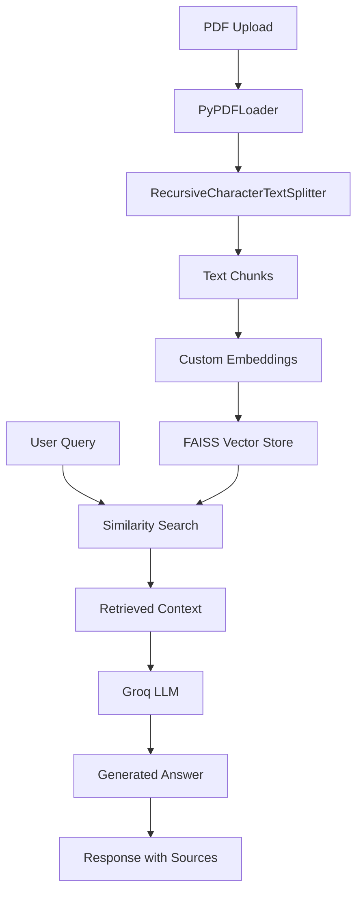

# Smart Research Assistant

An AI-powered document analysis tool that uses **LangChain** and **RAG (Retrieval-Augmented Generation)** to enable intelligent querying of PDF documents. Built with FastAPI backend and Next.js frontend.

## 🚀 Key Features

- **Document Upload & Processing**: Upload PDF documents with automatic text extraction and chunking
- **Intelligent Q&A**: Ask questions about your documents using natural language
- **Document Summarization**: Generate AI-powered summaries of uploaded documents
- **Source Citations**: Get references to specific pages and snippets from your documents
- **Real-time Chat Interface**: Interactive chat experience with your document knowledge base
- **Dark/Light Theme**: Modern UI with theme switching

## 🛠️ Technology Stack

### Backend (FastAPI + LangChain)
- **FastAPI**: High-performance Python web framework
- **LangChain**: Core framework for building LLM applications
  - `langchain-community`: Community integrations (PyPDFLoader, FAISS)
  - `langchain-core`: Core LangChain abstractions and interfaces
- **FAISS**: Facebook AI Similarity Search for vector storage
- **Groq API**: Fast inference API for Llama models
- **PyPDF**: PDF document processing

### Frontend (Next.js)
- **Next.js 15**: React framework with App Router
- **Tailwind CSS 4**: Utility-first CSS framework
- **shadcn/ui**: Modern UI component library
- **React Dropzone**: Drag-and-drop file upload
- **Axios**: HTTP client for API requests

## 📦 LangChain Integration Details

### Core LangChain Components Used

1. **Document Loaders**
   ```python
   from langchain_community.document_loaders import PyPDFLoader
   # Loads and extracts text from PDF documents
   ```

2. **Text Splitters**
   ```python
   from langchain.text_splitter import RecursiveCharacterTextSplitter
   # Intelligently chunks documents for optimal retrieval
   ```

3. **Vector Stores**
   ```python
   from langchain_community.vectorstores import FAISS
   # Stores document embeddings for similarity search
   ```

4. **Custom Chat Models**
   ```python
   from langchain_core.language_models.chat_models import BaseChatModel
   # Custom Groq integration for Llama model inference
   ```

5. **RAG Chains**
   ```python
   from langchain.chains import RetrievalQA
   # Combines retrieval with generation for accurate answers
   ```

6. **Embeddings**
   ```python
   from langchain_core.embeddings import Embeddings
   # Custom embedding implementation with fallback support
   ```

### RAG Pipeline Architecture



## 🔧 Setup & Installation

### Prerequisites
- Python 3.8+
- Node.js 18+
- Groq API key

### Backend Setup

1. **Navigate to backend directory**
   ```bash
   cd backend
   ```

2. **Create virtual environment**
   ```bash
   python -m venv venv
   source venv/bin/activate  # Linux/Mac
   # or
   venv\Scripts\activate  # Windows
   ```

3. **Install dependencies**
   ```bash
   pip install -r requirements.txt
   ```

4. **Set up environment variables**
   ```bash
   # Create .env file
   echo "GROK_API_KEY=your_groq_api_key_here" > .env
   ```

5. **Run the backend server**
   ```bash
   uvicorn app.main:app --reload --host 0.0.0.0 --port 8000
   ```

### Frontend Setup

1. **Navigate to frontend directory**
   ```bash
   cd frontend
   ```

2. **Install dependencies**
   ```bash
   npm install
   ```

3. **Run the development server**
   ```bash
   npm run dev
   ```

4. **Access the application**
   - Frontend: http://localhost:3000
   - Backend API: http://localhost:8000
   - API Documentation: http://localhost:8000/docs

## 🔑 Environment Configuration

### Backend (.env)
```bash
GROK_API_KEY=your_groq_api_key_here
```

### Getting a Groq API Key
1. Visit [Groq Console](https://console.groq.com/)
2. Sign up for an account
3. Generate an API key
4. Add it to your `.env` file

## 📚 API Endpoints

### Document Management
- `POST /documents/upload` - Upload and process PDF documents
- `GET /documents/` - List all processed documents
- `POST /documents/{doc_id}/summarize` - Generate document summary

### Chat Interface
- `POST /chat/` - Ask questions about uploaded documents

### Example API Usage
```python
import requests

# Upload a document
with open('document.pdf', 'rb') as f:
    response = requests.post(
        'http://localhost:8000/documents/upload',
        files={'file': f}
    )

# Ask a question
response = requests.post(
    'http://localhost:8000/chat/',
    json={
        'question': 'What are the main conclusions of this research?',
        'include_sources': True
    }
)
```

## 🏗️ Project Structure

```
smart-research-assistant/
├── backend/
│   ├── app/
│   │   ├── config.py              # Configuration and environment variables
│   │   ├── main.py               # FastAPI application setup
│   │   ├── routers/
│   │   │   ├── documents.py      # Document upload/processing endpoints
│   │   │   └── chat.py          # Chat/QA endpoints
│   │   ├── services/
│   │   │   ├── document_processor.py  # LangChain document processing
│   │   │   └── rag_service.py         # RAG chain implementation
│   │   └── utils/
│   │       ├── grok_integration.py    # Custom Groq LLM integration
│   │       └── error_handler.py       # Error handling utilities
│   ├── requirements.txt          # Python dependencies
│   └── .env                     # Environment variables
└── frontend/
    ├── src/
    │   ├── app/                 # Next.js App Router
    │   ├── components/          # React components
    │   └── lib/                # Utility functions
    ├── package.json            # Node.js dependencies
    └── tailwind.config.js     # Tailwind configuration
```

## 🎯 Key LangChain Features Implemented

### 1. Document Processing Pipeline
- **PDF Loading**: Uses `PyPDFLoader` to extract text from PDF files
- **Smart Chunking**: `RecursiveCharacterTextSplitter` breaks documents into optimal chunks
- **Batch Processing**: Handles large documents by processing in batches

### 2. Vector Storage & Retrieval
- **FAISS Integration**: Efficient similarity search for document chunks
- **Custom Embeddings**: Fallback embedding system with normalized vectors
- **Semantic Search**: Retrieves most relevant document sections for queries

### 3. Custom LLM Integration
- **Groq API Wrapper**: Custom LangChain-compatible chat model
- **Model Fallback**: Automatic model selection from available Groq models
- **Error Handling**: Graceful degradation when API is unavailable

### 4. RAG Implementation
- **RetrievalQA Chain**: Combines document retrieval with answer generation
- **Source Attribution**: Returns specific document sources with answers
- **Context Management**: Optimizes context window usage for better responses

## 🚀 Usage Examples

### Document Upload
1. Drag and drop a PDF file onto the upload area
2. Wait for processing (chunking and embedding)
3. Document appears in the sidebar

### Asking Questions
```
User: "What methodology was used in this research?"
Assistant: Based on the research paper, the methodology involved...
Sources: research_paper.pdf (Page 3) - "The study employed a mixed-methods approach..."
```

### Document Summarization
1. Click "Summarize" button next to any uploaded document
2. AI generates a structured summary with key points
3. Summary appears in chat interface and modal dialog

## 🔍 Advanced Features

### Chunking Strategy
- Chunk size: 1000 characters
- Overlap: 200 characters
- Preserves context across chunk boundaries

### Retrieval Configuration
- Returns top 4 most relevant chunks
- Uses cosine similarity for ranking
- Includes source metadata (page numbers, snippets)

### Model Configuration
- Primary: Llama 3.1 8B Instant
- Fallback: Automatic model selection
- Temperature: 0.1 (focused responses)

## 🛡️ Error Handling & Resilience

- **Model Availability**: Automatically selects available Groq models
- **File Processing**: Handles corrupted PDFs and extraction failures
- **API Limits**: Graceful degradation with informative error messages
- **Network Issues**: Retry logic and offline fallbacks

## 🤝 Contributing

1. Fork the repository
2. Create a feature branch
3. Make your changes
4. Add tests for new functionality
5. Submit a pull request

## 📄 License

This project is licensed under the MIT License - see the [LICENSE](LICENSE) file for details.

## 🙋‍♂️ Support

For questions or issues:
1. Check the API documentation at `/docs`
2. Review the error logs in the console
3. Ensure your Groq API key is valid
4. Verify all dependencies are installed correctly

## 🔄 Future Enhancements

- [ ] Support for additional document formats (DOCX, TXT, HTML)
- [ ] Advanced search filters and sorting
- [ ] Document comparison capabilities
- [ ] Export chat history and summaries
- [ ] Multi-language support
- [ ] Integration with cloud storage providers

---

Built with ❤️ using LangChain, FastAPI, and Next.js